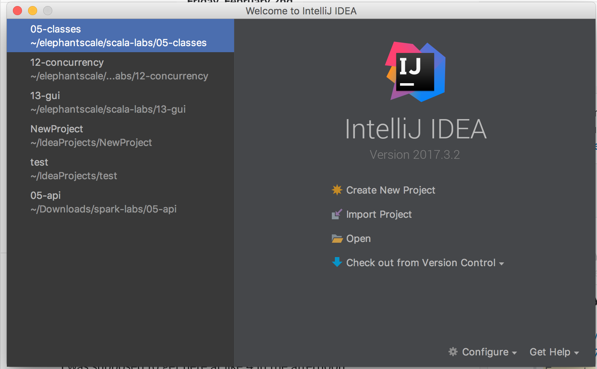

<link rel='stylesheet' href='../assets/css/main.css'/>

# Lab : Up and Running With Scala

### Overview

We will be running Scala in a single node mode.

### Depends On

None

### Run time

20 mins

## STEP 0: To Instructor

Please go through this lab on 'screen' first.

## STEP-1 : Install JDK 8 or 11

JDK 11 is preferred.  But if you have JDK 8, that is OK too.

[JDK 11 download](https://www.oracle.com/java/technologies/javase-jdk11-downloads.html)

Once installed, check by `java -version` command

```bash
    $  java -version
    # make sure you see version 11.x

    openjdk version "11.0.8" 2020-07-14
    OpenJDK Runtime Environment (build 11.0.8+10-post-Ubuntu-0ubuntu118.04.1)
    OpenJDK 64-Bit Server VM (build 11.0.8+10-post-Ubuntu-0ubuntu118.04.1, mixed mode, sharing)
```

## STEP 2: Install Scala 

Install Scala for your platform.

Get it from here : http://www.scala-lang.org/

It is easier to download the zip file and unzip it at a location and refer to it.  

For example, on Mac/Ubuntu, if you extracted scala at `$HOME/apps/scala`,  you can invoke as `$HOME/apps/scala/bin/scala`

And on Windows, you installed it under `C:\scala`.  And then invoke it as `C:\scala\bin\scala`

Verify the *scala version* and *java version* printed out.

```bash
$ ~/apps/scala/bin/scala 

Welcome to Scala 2.13.8 (OpenJDK 64-Bit Server VM, Java 11.0.8).
Type in expressions for evaluation. Or try :help.

scala> 

```


## STEP 3: Install SBT

Also Install SBT for your platform.

Download SBT from [here](https://www.scala-sbt.org/)

Again it is easier to get the zip version and extract into a dir.  For example in `$HOME/apps/sbt`  or `C:\sbt`

Verify sbt by using `sbt --version` command on terminal

```bash
    $   sbt --version
    # output:
    #  sbt script version: 1.6.2
```

## STEP 4: Install Intellij

Download and install [IntelliJ](https://www.jetbrains.com/idea/).  **Community edition** is recommended.

### Install Scala support

Do this either way

- during the first launch; you will be prompted to install Scala support
- Go to `Settings --> Plugins --> Marketplace`  and install Scala support

## STEP 5: Start IntelliJ

You should see something like this:



## STEP 6:  Import this Project as an SBT Project

From IntelliJ

- `File --> New Project --> From existing files`
- or `File --> Open Project`
- Navigate to `scala-labs/01-install` directory
- Click OK to import this project

First import will take some time, as IntelliJ downloads all dependencies and bootstraps

## Step 7: Try to Run the application.

Click on `Hello` class and select `Run`
