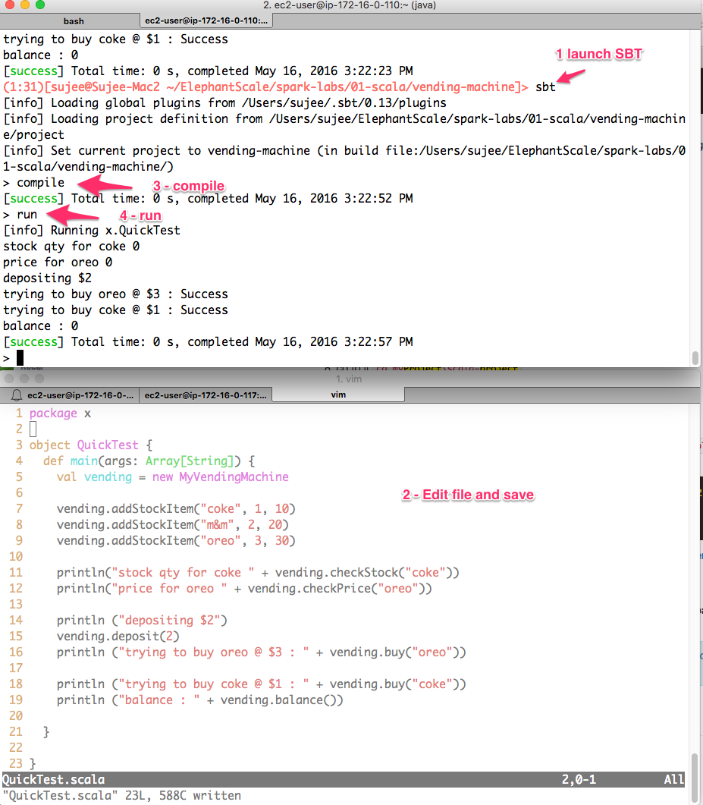

<link rel='stylesheet' href='../../../assets/css/main.css'/>

# Project: Implement A Vending Machine Solution In Scala

## Overview

Implement a Vending Machine in Scala

### Depends On

None

### Run time

30 mins

## Recommended Setup (In order of preference)

* If you are using an IDE (like IntelliJ)  please open the project as an SBT project.
* If you are using a UI editor like 'Sublime'  open the 'project root directory'  in editor (so you can navigate to all files easily).
* If using command line, please open 2 terminals - 1 for editing files and other for running commands.

## Step 0 : Instructor

* Get the lab started on your screen. 
* Then let the class complete rest of the TODO items.

## Step 1 : Project Directory

Project directory is : `spark-labs/projects/vending-machine`

Here is the project hierarchy:

## Step 2 : Open Project in IntelliJ

* File -> Import --> From Existing sources
* Select : `spark-labs/projects/vending-machine` directory
* Choose `open as SBT`

## Step 3 : Inspect 'VendingMachine' trait

Inspect  the file `src/main/scala/x/VendingMachine.scala`.  

This file defines the `trait` for a `VendingMachine`

Also notice how `ReturnCode` is defined.

## Step 4 : Vending Machine Test Driver

* Inspect  the file `src/main/scala/x/QuickTest.scala`  
* Run this file by 'Right Click -> Run'
* Your output may look like this

```console
```

As you can see, the implementation needs work.

## Step 5 : Vending Machine Implementation

* Inspect  the file `src/main/scala/x/MyVendingMachine.scala`
* We are going to fix `TODO` items in this file
* Fix TODOs one function at a time
* And run the QuickTest driver to verify that the code is working properly

---

## Optional Reference for Using SBT tool

Here is how you can build the project with SBT.

### 2 Terminals

Please open 2 terminals - 1 for editing files and other for running commands.



### Project root directory

Make sure you are in the project top level directory.

```
    $   cd   scala-labs/projects/vending-machine

    # see the project structure
    $   find .  | grep -v target
```


### SBT

Using one terminal, launch SBT from project root directory.
```
    $   cd   scala-labs/projects/vending-machine

    $   sbt

```

### Running the program in SBT

SBT Commands
* compile : will compile the program
* run : compile and run the program

Let's try this test driver. On your SBT terminal type
```
    sbt>
          run
```

You will see following output from our test driver class.
```console
    > run
```

### Once you edit a file and save it, you can run from SBT as follows

```
    sbt> 
            compile
            run
```

## SBT Tips

### SBT Shell

You can issue sbt commands from shell as follows
```
    $   sbt  clean;compile;run
```

For iterative development, sbt shell is much faster !

```
    $   sbt
    > clean
    > compile
    > run
```

### Specifying A Main Class To Run

```
    $  sbt  "run-main x.Foo"
```

```
    # in sbt shell
    >   runMain  x.foo
```
